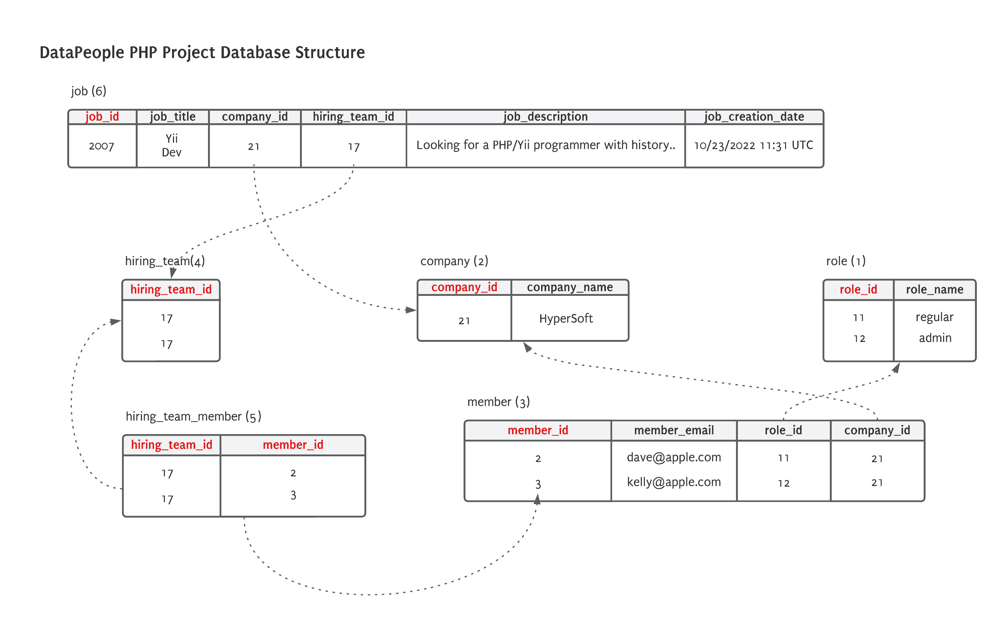

## Deployment

`docker-compose up`

The command above will create two docker containers.  One container to run the API, and another to run the MySQL server.
When the containers first start, a database will be provisioned and data will be imported.
Once data has been imported, the server will be started and you can access the server locally using port `8081`.  When 
going directly to the API, you will be presented with the API documentation.

> NOTE: You need a file in the root directory called project_data.jsonl.  This file will be picked up by the ingestor.

## Database Design

### Things I would have done differently if I had more time
- Spend more time studying the Yii framework.  Given this was my first time using the framework, it is very likely there 
are better ways of doing things.
- Validate user input.
- More defensive programming.
- Use a production server like ngnix or Apache and use some sort of container orchestration like Kubernetes or ECS.
- Create an import report instead of just printing stuff to std.
- Allow you to pass in a file name to be imported.  This file would be mounted using its own mount point. 
- Maybe create a custom docker image with debian deps already installed.
- Determine data integrity.  I did not have the time to see if the data was imported 100% correctly.  
- Use a more light-weight container like Alpine.  
- Install linting for the project to force consistency.

### Considerations
- Instead of using an ingestor I built, I might have looked at a third-party solution, especially if there was more 
data, transformations were needed and the data needed to be imported continuously.